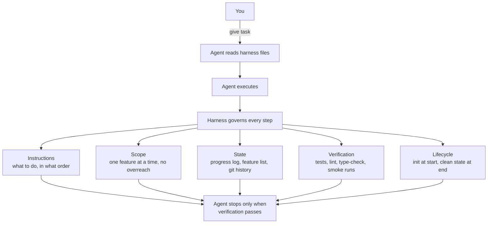
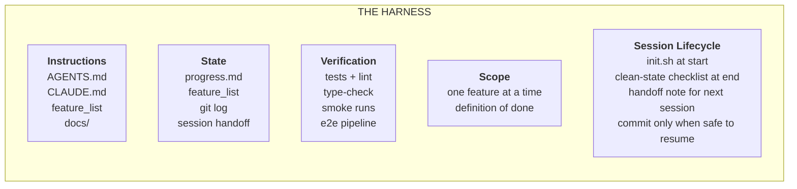

# Harness Engineering

## What Harness Engineering Actually Means

Harness engineering is about building a complete working environment around the model so it produces reliable results. It's not about writing better prompts. It's about designing the system the model operates inside.

A harness has five subsystems:

> The MODEL decides what code to write. The HARNESS governs when, where, and how it writes it. The harness doesn't make the model smarter — it makes the model's output reliable.

Each subsystem has one job:

- **Instructions** — Tell the agent what to do, in what order, and what to read before starting. Not one giant file; a progressive disclosure structure the agent navigates on demand.
- **State** — Track what's been done, what's in progress, and what's next. Persisted to disk so the next session picks up exactly where the last one left off.
- **Verification** — Only a passing test suite counts as evidence. The agent cannot declare victory without runnable proof.
- **Scope** — Constrain the agent to one feature at a time. No overreach. No half-finishing three things. No rewriting the feature list to hide unfinished work.
- **Session Lifecycle** — Initialize at the start. Clean up at the end. Leave a clean restart path for the next session.

## Without vs. With a Harness

| Without Harness | With Harness |
| --- | --- |
| **Session 1:** agent writes code | **Session 1:** agent reads instructions |
| agent breaks tests | agent runs `init.sh` |
| agent says "done" | agent works on one feature |
| you fix it manually | agent verifies before claiming done |
| | agent updates progress log |
| | agent commits clean state |
| **Session 2:** agent starts fresh | **Session 2:** agent reads progress log |
| agent has no memory of what happened before | agent picks up exactly where it left off |
| agent re-does work, or does something else entirely | agent continues the unfinished feature |
| you fix it again | you review, not rescue |
| **Result:** you spend more time cleaning up than if you did it yourself | **Result:** agent does the work, you verify the result |
